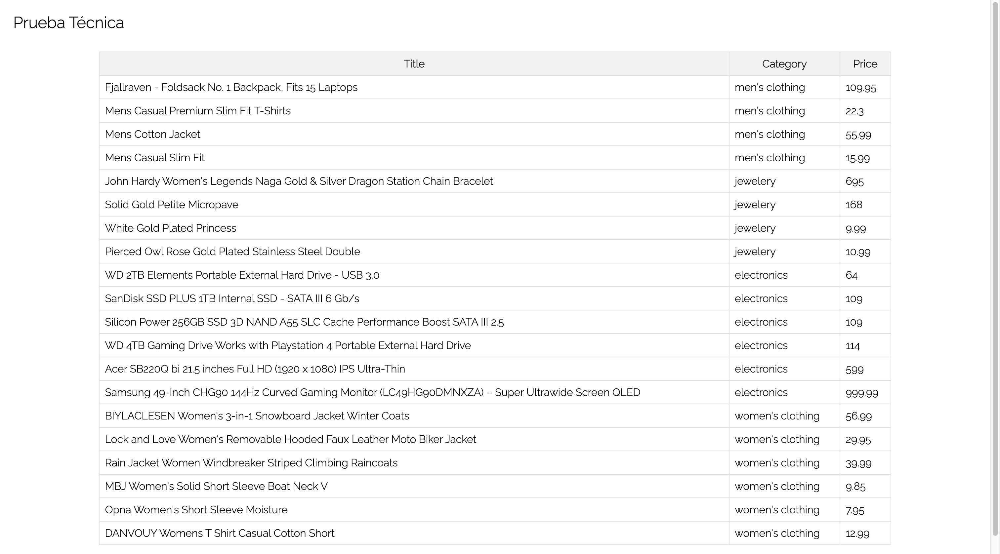

<h1 align="center">Prueba Técnica</h1>

## 📝 About the project

The project consists in printing the products brought from an external API. Here's the <a href="https://fakestoreapi.com/">link</a>.
The original project was made in React, here's the <a href="https://github.com/nblancoz/PruebaTecnicaTheBridge-React">link</a>

## 💻 Technologies used in the project

  <!--ANGULAR-->
  
  <!--JAVASCRIPT-->
  
  <!--TYPESCRIPT-->
  
  <!--SASS-->
  
  <!--NPM-->
  

## 🫡 Requirements

<ul>
    <li>
    Create a table in which the products are shown. It must contain the title, category and the price of the product.
    </li>
    <li>
    Pagination and sorting in all the columns was indispensable.
    </li>
    <li>
    The design was not valuable.
    </li>
</ul>

### 🖼️ Preview

### 🪪 Licence

This project is under licence of Nicolás Blanco Zappalá

### 📱 Contact

 Nicolás Blanco Zappalá

     

